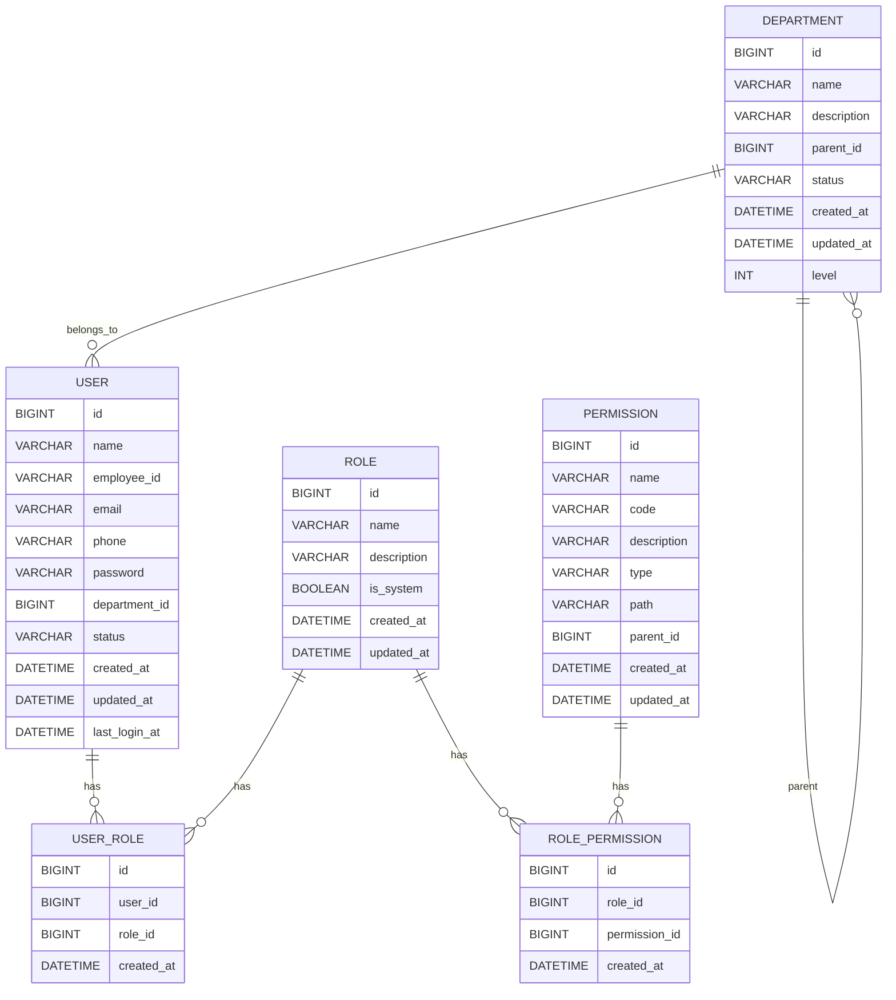

# 组织架构与权限体系维护系统 - 数据模型设计

## 1. 数据库表结构

### 1.1 用户表 (`***_user`)

| 字段名 | 数据类型 | 约束 | 描述 |
| :--- | :--- | :--- | :--- |
| `id` | `BIGINT` | `PRIMARY KEY, AUTO_INCREMENT` | 用户ID |
| `name` | `VARCHAR(50)` | `NOT NULL` | 姓名 |
| `employee_id` | `VARCHAR(20)` | `UNIQUE, NOT NULL` | 工号 |
| `email` | `VARCHAR(100)` | `UNIQUE` | 邮箱 |
| `phone` | `VARCHAR(20)` | | 电话 |
| `password` | `VARCHAR(100)` | `NOT NULL` | 密码（加密存储） |
| `department_id` | `BIGINT` | `REFERENCES ***_department(id)` | 所属部门ID |
| `status` | `VARCHAR(20)` | `NOT NULL, DEFAULT 'ACTIVE'` | 状态（ACTIVE: 活跃, DISABLED: 禁用, DELETED: 已注销） |
| `created_at` | `DATETIME` | `NOT NULL, DEFAULT CURRENT_TIMESTAMP` | 创建时间 |
| `updated_at` | `DATETIME` | `NOT NULL, DEFAULT CURRENT_TIMESTAMP ON UPDATE CURRENT_TIMESTAMP` | 更新时间 |
| `last_login_at` | `DATETIME` | | 最后登录时间 |

### 1.2 部门表 (`***_department`)

| 字段名 | 数据类型 | 约束 | 描述 |
| :--- | :--- | :--- | :--- |
| `id` | `BIGINT` | `PRIMARY KEY, AUTO_INCREMENT` | 部门ID |
| `name` | `VARCHAR(50)` | `NOT NULL` | 部门名称 |
| `description` | `VARCHAR(200)` | | 部门描述 |
| `parent_id` | `BIGINT` | `REFERENCES ***_department(id)` | 上级部门ID |
| `status` | `VARCHAR(20)` | `NOT NULL, DEFAULT 'NORMAL'` | 状态（NORMAL: 正常, MERGED: 已合并, CANCELLED: 已撤销, ARCHIVED: 归档） |
| `created_at` | `DATETIME` | `NOT NULL, DEFAULT CURRENT_TIMESTAMP` | 创建时间 |
| `updated_at` | `DATETIME` | `NOT NULL, DEFAULT CURRENT_TIMESTAMP ON UPDATE CURRENT_TIMESTAMP` | 更新时间 |
| `level` | `INT` | `NOT NULL, DEFAULT 1` | 部门层级 |

### 1.3 角色表 (`***_role`)

| 字段名 | 数据类型 | 约束 | 描述 |
| :--- | :--- | :--- | :--- |
| `id` | `BIGINT` | `PRIMARY KEY, AUTO_INCREMENT` | 角色ID |
| `name` | `VARCHAR(50)` | `UNIQUE, NOT NULL` | 角色名称 |
| `description` | `VARCHAR(200)` | | 角色描述 |
| `created_at` | `DATETIME` | `NOT NULL, DEFAULT CURRENT_TIMESTAMP` | 创建时间 |
| `updated_at` | `DATETIME` | `NOT NULL, DEFAULT CURRENT_TIMESTAMP ON UPDATE CURRENT_TIMESTAMP` | 更新时间 |
| `is_system` | `BOOLEAN` | `NOT NULL, DEFAULT FALSE` | 是否系统内置角色 |

### 1.4 权限表 (`***_permission`)

| 字段名 | 数据类型 | 约束 | 描述 |
| :--- | :--- | :--- | :--- |
| `id` | `BIGINT` | `PRIMARY KEY, AUTO_INCREMENT` | 权限ID |
| `name` | `VARCHAR(50)` | `NOT NULL` | 权限名称 |
| `code` | `VARCHAR(50)` | `UNIQUE, NOT NULL` | 权限代码 |
| `description` | `VARCHAR(200)` | | 权限描述 |
| `type` | `VARCHAR(20)` | `NOT NULL` | 权限类型（MENU: 菜单, BUTTON: 按钮, API: 接口） |
| `path` | `VARCHAR(100)` | | 权限路径（如菜单路径或API路径） |
| `parent_id` | `BIGINT` | `REFERENCES ***_permission(id)` | 上级权限ID |
| `created_at` | `DATETIME` | `NOT NULL, DEFAULT CURRENT_TIMESTAMP` | 创建时间 |
| `updated_at` | `DATETIME` | `NOT NULL, DEFAULT CURRENT_TIMESTAMP ON UPDATE CURRENT_TIMESTAMP` | 更新时间 |

### 1.5 用户角色关系表 (`***_user_role`)

| 字段名 | 数据类型 | 约束 | 描述 |
| :--- | :--- | :--- | :--- |
| `id` | `BIGINT` | `PRIMARY KEY, AUTO_INCREMENT` | 关系ID |
| `user_id` | `BIGINT` | `NOT NULL, REFERENCES ***_user(id)` | 用户ID |
| `role_id` | `BIGINT` | `NOT NULL, REFERENCES ***_role(id)` | 角色ID |
| `created_at` | `DATETIME` | `NOT NULL, DEFAULT CURRENT_TIMESTAMP` | 创建时间 |

### 1.6 角色权限关系表 (`***_role_permission`)

| 字段名 | 数据类型 | 约束 | 描述 |
| :--- | :--- | :--- | :--- |
| `id` | `BIGINT` | `PRIMARY KEY, AUTO_INCREMENT` | 关系ID |
| `role_id` | `BIGINT` | `NOT NULL, REFERENCES ***_role(id)` | 角色ID |
| `permission_id` | `BIGINT` | `NOT NULL, REFERENCES ***_permission(id)` | 权限ID |
| `created_at` | `DATETIME` | `NOT NULL, DEFAULT CURRENT_TIMESTAMP` | 创建时间 |

## 2. 实体关系图

## 3. 数据模型设计说明

### 3.1 用户模型
- **状态管理**: 用户状态包括活跃(ACTIVE)、禁用(DISABLED)、已注销(DELETED)，状态转换规则为：活跃 ↔ 禁用 → 已注销（不可逆）
- **密码安全**: 密码采用BCrypt等算法加密存储，确保安全性
- **部门关联**: 用户与部门是多对一关系，一个用户只能属于一个部门，一个部门可以有多个用户
- **角色关联**: 用户与角色是多对多关系，一个用户可以拥有多个角色，一个角色可以分配给多个用户

### 3.2 部门模型
- **层级结构**: 部门采用自引用外键实现树形层级结构，parent_id指向父部门
- **状态管理**: 部门状态包括正常(NORMAL)、已合并(MERGED)、已撤销(CANCELLED)、归档(ARCHIVED)
- **层级深度**: 部门层级深度建议不超过10级，以保证系统性能
- **唯一性约束**: 部门名称在同一层级下必须唯一

### 3.3 角色模型
- **系统内置角色**: 系统管理员等关键角色标记为系统内置角色，不可修改或删除
- **权限集合**: 角色是权限的集合，通过角色权限关系表与权限关联
- **用户分配**: 角色通过用户角色关系表分配给用户，用户继承角色的所有权限

### 3.4 权限模型
- **权限类型**: 权限分为菜单(MENU)、按钮(BUTTON)、接口(API)三种类型
- **层级结构**: 权限可以有层级结构，如菜单包含子菜单
- **权限代码**: 权限代码用于系统内部权限校验，必须唯一

### 3.5 关系模型
- **用户角色关系**: 多对多关系，记录用户与角色的分配关系
- **角色权限关系**: 多对多关系，记录角色与权限的关联关系

## 4. 数据验证规则

### 4.1 用户验证规则
- **姓名**: 必填，长度1-50个字符
- **工号**: 必填，长度1-20个字符，唯一
- **邮箱**: 可选，格式必须符合邮箱规范，唯一
- **电话**: 可选，格式必须符合电话号码规范
- **密码**: 必填，长度至少6个字符
- **部门ID**: 必填，必须是存在的部门
- **状态**: 必填，必须是ACTIVE、DISABLED或DELETED之一

### 4.2 部门验证规则
- **部门名称**: 必填，长度1-50个字符，同一层级下唯一
- **上级部门ID**: 可选，必须是存在的部门，且不能形成循环引用
- **状态**: 必填，必须是NORMAL、MERGED、CANCELLED或ARCHIVED之一
- **层级**: 必填，必须是正整数

### 4.3 角色验证规则
- **角色名称**: 必填，长度1-50个字符，唯一
- **描述**: 可选，长度最多200个字符
- **是否系统内置**: 必填，布尔值

### 4.4 权限验证规则
- **权限名称**: 必填，长度1-50个字符
- **权限代码**: 必填，长度1-50个字符，唯一
- **描述**: 可选，长度最多200个字符
- **权限类型**: 必填，必须是MENU、BUTTON或API之一
- **路径**: 可选，长度最多100个字符
- **上级权限ID**: 可选，必须是存在的权限

## 5. 数据操作注意事项

### 5.1 用户操作
- **批量操作**: 对大量用户进行批量操作时，应使用异步处理方式，避免阻塞系统
- **密码重置**: 重置密码时，应生成临时密码并提示用户首次登录必须修改密码
- **状态变更**: 用户状态变更时，应记录操作日志，便于审计

### 5.2 部门操作
- **部门合并**: 合并部门时，应将被合并部门的所有用户和子部门自动归属到目标部门
- **部门撤销**: 撤销部门前，必须先处理该部门的所有用户（转移或注销）和子部门（转移或撤销）
- **层级调整**: 调整部门层级时，应更新该部门及其所有子部门的level字段

### 5.3 角色操作
- **系统角色保护**: 系统内置角色（如系统管理员）不可修改或删除
- **权限分配**: 为角色分配权限时，应遵循最小权限原则

### 5.4 权限操作
- **权限继承**: 菜单权限应支持继承，即拥有父菜单权限的用户自动拥有子菜单权限
- **权限校验**: 系统应在API接口层面进行权限校验，确保用户只能访问被授权的接口

## 6. 数据库索引设计

### 6.1 用户表索引
- `PRIMARY KEY` (`id`)
- `UNIQUE INDEX` (`employee_id`)
- `UNIQUE INDEX` (`email`)
- `INDEX` (`department_id`)
- `INDEX` (`status`)
- `INDEX` (`created_at`)

### 6.2 部门表索引
- `PRIMARY KEY` (`id`)
- `INDEX` (`parent_id`)
- `INDEX` (`status`)
- `INDEX` (`level`)

### 6.3 角色表索引
- `PRIMARY KEY` (`id`)
- `UNIQUE INDEX` (`name`)
- `INDEX` (`is_system`)

### 6.4 权限表索引
- `PRIMARY KEY` (`id`)
- `UNIQUE INDEX` (`code`)
- `INDEX` (`parent_id`)
- `INDEX` (`type`)

### 6.5 用户角色关系表索引
- `PRIMARY KEY` (`id`)
- `UNIQUE INDEX` (`user_id`, `role_id`)
- `INDEX` (`user_id`)
- `INDEX` (`role_id`)

### 6.6 角色权限关系表索引
- `PRIMARY KEY` (`id`)
- `UNIQUE INDEX` (`role_id`, `permission_id`)
- `INDEX` (`role_id`)
- `INDEX` (`permission_id`)

## 7. 数据迁移策略

### 7.1 初始数据
- **系统角色**: 系统初始化时应创建系统管理员角色，拥有所有权限
- **默认权限**: 系统初始化时应创建基础的权限数据，如用户管理、部门管理、角色管理等权限
- **默认用户**: 系统初始化时应创建一个系统管理员用户，用于首次登录和系统配置

### 7.2 数据同步
- **部门数据同步**: 当单位组织架构发生变化时，应及时同步更新部门数据
- **用户数据同步**: 当人员变动时，应及时同步更新用户数据

### 7.3 数据备份
- **定期备份**: 应定期备份数据库，确保数据安全
- **增量备份**: 对于重要操作，如批量用户操作、部门结构调整等，应在操作前进行增量备份

## 8. 性能优化考虑

### 8.1 查询优化
- **部门树形结构查询**: 对于部门树形结构查询，可考虑使用递归查询或闭包表设计，提高查询性能
- **用户权限查询**: 对于用户权限查询，可考虑使用缓存机制，减少数据库查询次数

### 8.2 批量操作优化
- **批量插入**: 使用MyBatis-Plus的批量插入功能，减少SQL执行次数
- **批量更新**: 使用批量更新语句，减少数据库连接次数
- **异步处理**: 对于大量数据的批量操作，应使用异步处理方式，避免阻塞主线程

### 8.3 缓存策略
- **角色权限缓存**: 缓存角色的权限信息，减少权限校验时的数据库查询
- **部门结构缓存**: 缓存部门树形结构，减少部门查询时的数据库操作
- **用户信息缓存**: 缓存活跃用户的信息，减少用户登录时的数据库查询
