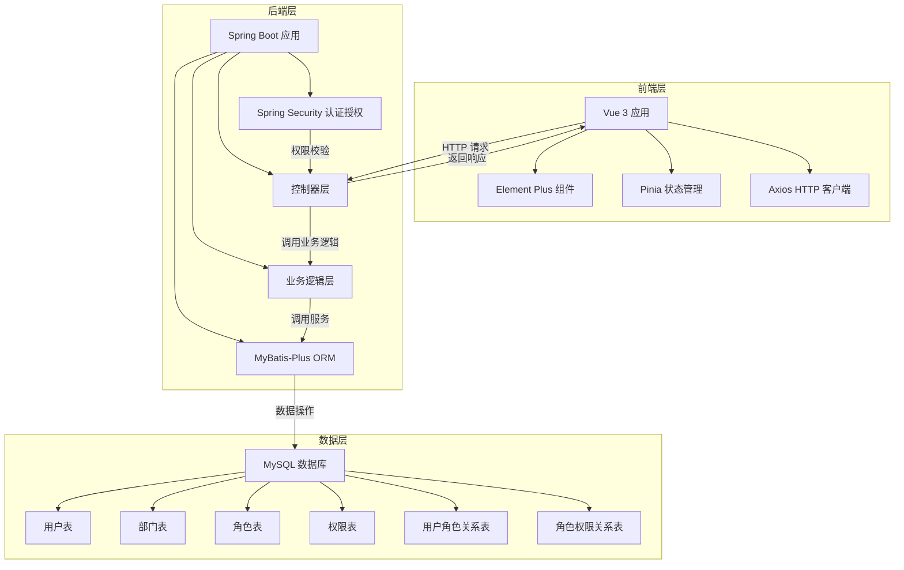

# 组织架构与权限体系维护系统 - 技术实现计划

## 1. 技术架构分析

### 1.1 前端技术栈
- **框架**: Vue.js 3.3+ (根据前端代码规范)
- **构建工具**: Vite 4.4+ (根据前端代码规范)
- **语言**: TypeScript 5.0+ (根据前端代码规范)
- **状态管理**: Pinia 2.1+ (根据前端代码规范)
- **HTTP客户端**: Axios 1.5+ (根据前端代码规范)
- **UI框架**: Element Plus 2.3+ (根据前端代码规范)
- **CSS预处理器**: SCSS 1.6+ (根据前端代码规范)

### 1.2 后端技术栈
- **框架**: Spring Boot 3.0+ (根据后端代码规范)
- **ORM框架**: MyBatis-Plus 3.5+ (根据后端代码规范)
- **数据库**: MySQL 8.0+ (根据需求分析)
- **连接池**: HikariCP 5.0+ (根据后端代码规范)
- **认证框架**: Spring Security 6.0+ (推断，用于权限管理)

### 1.3 数据库设计
- **表前缀**: 使用 `auth_` 前缀 (根据用户要求)
- **核心表**: 
  - `auth_user` (用户表)
  - `auth_department` (部门表)
  - `auth_role` (角色表)
  - `auth_permission` (权限表)
  - `auth_user_role` (用户角色关系表)
  - `auth_role_permission` (角色权限关系表)

### 1.4 系统架构



## 2. 核心功能模块设计

### 2.1 用户管理模块

#### 2.1.1 前端设计
- **页面组件**: `UserManagement.vue`
- **功能**: 
  - 用户列表展示（支持分页、搜索）
  - 新增用户表单
  - 编辑用户表单
  - 重置密码功能
  - 禁用/启用用户功能
  - 注销用户功能
  - 批量操作功能

#### 2.1.2 后端设计
- **控制器**: `UserController.java`
- **服务**: `UserService.java`
- **数据访问**: `UserMapper.java`
- **DTO**: `UserCreateDTO.java`, `UserUpdateDTO.java`
- **API接口**: 
  - `GET /api/users` - 获取用户列表
  - `POST /api/users` - 新增用户
  - `GET /api/users/{id}` - 获取用户详情
  - `PUT /api/users/{id}` - 更新用户
  - `DELETE /api/users/{id}` - 注销用户
  - `POST /api/users/{id}/reset-password` - 重置密码
  - `POST /api/users/{id}/disable` - 禁用用户
  - `POST /api/users/{id}/enable` - 启用用户
  - `POST /api/users/batch` - 批量操作用户

### 2.2 部门管理模块

#### 2.2.1 前端设计
- **页面组件**: `DepartmentManagement.vue`
- **功能**: 
  - 部门树形结构展示
  - 新增部门表单
  - 编辑部门表单
  - 合并部门功能
  - 撤销部门功能
  - 调整部门层级功能

#### 2.2.2 后端设计
- **控制器**: `DepartmentController.java`
- **服务**: `DepartmentService.java`
- **数据访问**: `DepartmentMapper.java`
- **DTO**: `DepartmentCreateDTO.java`, `DepartmentUpdateDTO.java`
- **API接口**: 
  - `GET /api/departments` - 获取部门列表
  - `POST /api/departments` - 新增部门
  - `GET /api/departments/{id}` - 获取部门详情
  - `PUT /api/departments/{id}` - 更新部门
  - `DELETE /api/departments/{id}` - 撤销部门
  - `POST /api/departments/merge` - 合并部门

### 2.3 角色管理模块

#### 2.3.1 前端设计
- **页面组件**: `RoleManagement.vue`
- **功能**: 
  - 角色列表展示
  - 新增角色表单
  - 编辑角色表单
  - 角色权限设置
  - 删除角色功能

#### 2.3.2 后端设计
- **控制器**: `RoleController.java`
- **服务**: `RoleService.java`
- **数据访问**: `RoleMapper.java`
- **DTO**: `RoleCreateDTO.java`, `RoleUpdateDTO.java`
- **API接口**: 
  - `GET /api/roles` - 获取角色列表
  - `POST /api/roles` - 新增角色
  - `GET /api/roles/{id}` - 获取角色详情
  - `PUT /api/roles/{id}` - 更新角色
  - `DELETE /api/roles/{id}` - 删除角色
  - `GET /api/roles/{id}/permissions` - 获取角色权限
  - `PUT /api/roles/{id}/permissions` - 更新角色权限

### 2.4 权限管理模块

#### 2.4.1 前端设计
- **页面组件**: `PermissionManagement.vue` (可选)
- **功能**: 
  - 权限列表展示
  - 权限树形结构展示

#### 2.4.2 后端设计
- **控制器**: `PermissionController.java`
- **服务**: `PermissionService.java`
- **数据访问**: `PermissionMapper.java`
- **API接口**: 
  - `GET /api/permissions` - 获取权限列表

## 3. 数据库表设计

### 3.1 用户表 (`auth_user`)

| 字段名 | 数据类型 | 约束 | 描述 |
| :--- | :--- | :--- | :--- |
| `id` | `BIGINT` | `PRIMARY KEY, AUTO_INCREMENT` | 用户ID |
| `name` | `VARCHAR(50)` | `NOT NULL` | 姓名 |
| `employee_id` | `VARCHAR(20)` | `UNIQUE, NOT NULL` | 工号 |
| `email` | `VARCHAR(100)` | `UNIQUE` | 邮箱 |
| `phone` | `VARCHAR(20)` | | 电话 |
| `password` | `VARCHAR(100)` | `NOT NULL` | 密码（加密存储） |
| `department_id` | `BIGINT` | `REFERENCES auth_department(id)` | 所属部门ID |
| `status` | `VARCHAR(20)` | `NOT NULL, DEFAULT 'ACTIVE'` | 状态（ACTIVE: 活跃, DISABLED: 禁用, DELETED: 已注销） |
| `created_at` | `DATETIME` | `NOT NULL, DEFAULT CURRENT_TIMESTAMP` | 创建时间 |
| `updated_at` | `DATETIME` | `NOT NULL, DEFAULT CURRENT_TIMESTAMP ON UPDATE CURRENT_TIMESTAMP` | 更新时间 |
| `last_login_at` | `DATETIME` | | 最后登录时间 |

### 3.2 部门表 (`auth_department`)

| 字段名 | 数据类型 | 约束 | 描述 |
| :--- | :--- | :--- | :--- |
| `id` | `BIGINT` | `PRIMARY KEY, AUTO_INCREMENT` | 部门ID |
| `name` | `VARCHAR(50)` | `NOT NULL` | 部门名称 |
| `description` | `VARCHAR(200)` | | 部门描述 |
| `parent_id` | `BIGINT` | `REFERENCES auth_department(id)` | 上级部门ID |
| `status` | `VARCHAR(20)` | `NOT NULL, DEFAULT 'NORMAL'` | 状态（NORMAL: 正常, MERGED: 已合并, CANCELLED: 已撤销, ARCHIVED: 归档） |
| `created_at` | `DATETIME` | `NOT NULL, DEFAULT CURRENT_TIMESTAMP` | 创建时间 |
| `updated_at` | `DATETIME` | `NOT NULL, DEFAULT CURRENT_TIMESTAMP ON UPDATE CURRENT_TIMESTAMP` | 更新时间 |
| `level` | `INT` | `NOT NULL, DEFAULT 1` | 部门层级 |

### 3.3 角色表 (`auth_role`)

| 字段名 | 数据类型 | 约束 | 描述 |
| :--- | :--- | :--- | :--- |
| `id` | `BIGINT` | `PRIMARY KEY, AUTO_INCREMENT` | 角色ID |
| `name` | `VARCHAR(50)` | `UNIQUE, NOT NULL` | 角色名称 |
| `description` | `VARCHAR(200)` | | 角色描述 |
| `created_at` | `DATETIME` | `NOT NULL, DEFAULT CURRENT_TIMESTAMP` | 创建时间 |
| `updated_at` | `DATETIME` | `NOT NULL, DEFAULT CURRENT_TIMESTAMP ON UPDATE CURRENT_TIMESTAMP` | 更新时间 |
| `is_system` | `BOOLEAN` | `NOT NULL, DEFAULT FALSE` | 是否系统内置角色 |

### 3.4 权限表 (`auth_permission`)

| 字段名 | 数据类型 | 约束 | 描述 |
| :--- | :--- | :--- | :--- |
| `id` | `BIGINT` | `PRIMARY KEY, AUTO_INCREMENT` | 权限ID |
| `name` | `VARCHAR(50)` | `NOT NULL` | 权限名称 |
| `code` | `VARCHAR(50)` | `UNIQUE, NOT NULL` | 权限代码 |
| `description` | `VARCHAR(200)` | | 权限描述 |
| `type` | `VARCHAR(20)` | `NOT NULL` | 权限类型（MENU: 菜单, BUTTON: 按钮, API: 接口） |
| `path` | `VARCHAR(100)` | | 权限路径（如菜单路径或API路径） |
| `parent_id` | `BIGINT` | `REFERENCES auth_permission(id)` | 上级权限ID |
| `created_at` | `DATETIME` | `NOT NULL, DEFAULT CURRENT_TIMESTAMP` | 创建时间 |
| `updated_at` | `DATETIME` | `NOT NULL, DEFAULT CURRENT_TIMESTAMP ON UPDATE CURRENT_TIMESTAMP` | 更新时间 |

### 3.5 用户角色关系表 (`auth_user_role`)

| 字段名 | 数据类型 | 约束 | 描述 |
| :--- | :--- | :--- | :--- |
| `id` | `BIGINT` | `PRIMARY KEY, AUTO_INCREMENT` | 关系ID |
| `user_id` | `BIGINT` | `NOT NULL, REFERENCES auth_user(id)` | 用户ID |
| `role_id` | `BIGINT` | `NOT NULL, REFERENCES auth_role(id)` | 角色ID |
| `created_at` | `DATETIME` | `NOT NULL, DEFAULT CURRENT_TIMESTAMP` | 创建时间 |

### 3.6 角色权限关系表 (`auth_role_permission`)

| 字段名 | 数据类型 | 约束 | 描述 |
| :--- | :--- | :--- | :--- |
| `id` | `BIGINT` | `PRIMARY KEY, AUTO_INCREMENT` | 关系ID |
| `role_id` | `BIGINT` | `NOT NULL, REFERENCES auth_role(id)` | 角色ID |
| `permission_id` | `BIGINT` | `NOT NULL, REFERENCES auth_permission(id)` | 权限ID |
| `created_at` | `DATETIME` | `NOT NULL, DEFAULT CURRENT_TIMESTAMP` | 创建时间 |

## 4. 前端实现细节

### 4.1 项目结构

```
front-end/
├── public/                 # 静态资源
├── src/
│   ├── assets/             # 图片、图标等资源
│   ├── components/         # 通用组件
│   │   ├── base/           # 基础组件
│   │   └── business/       # 业务组件
│   ├── views/              # 页面组件
│   │   ├── user/           # 用户管理相关页面
│   │   ├── department/     # 部门管理相关页面
│   │   └── role/           # 角色管理相关页面
│   ├── router/             # 路由配置
│   ├── store/              # Pinia状态管理
│   ├── api/                # API请求
│   ├── utils/              # 工具函数
│   ├── styles/             # 全局样式
│   ├── types/              # TypeScript类型定义
│   ├── constants/          # 常量定义
│   ├── hooks/              # 自定义Hooks
│   ├── App.vue             # 根组件
│   └── main.ts             # 入口文件
├── index.html              # HTML模板
├── tsconfig.json           # TypeScript配置
├── vite.config.ts          # Vite配置
├── package.json            # 依赖管理
└── README.md               # 项目说明
```

### 4.2 路由配置

```typescript
// router/index.ts
import { createRouter, createWebHistory } from 'vue-router'
import type { RouteRecordRaw } from 'vue-router'

const routes: RouteRecordRaw[] = [
  {
    path: '/',
    redirect: '/system'
  },
  {
    path: '/system',
    component: () => import('@/views/system/SystemManagement.vue'),
    children: [
      {
        path: 'user',
        component: () => import('@/views/user/UserManagement.vue'),
        meta: { title: '用户管理', requiresAuth: true }
      },
      {
        path: 'department',
        component: () => import('@/views/department/DepartmentManagement.vue'),
        meta: { title: '部门管理', requiresAuth: true }
      },
      {
        path: 'role',
        component: () => import('@/views/role/RoleManagement.vue'),
        meta: { title: '角色管理', requiresAuth: true }
      }
    ]
  }
]

const router = createRouter({
  history: createWebHistory(),
  routes
})

export default router
```

### 4.3 状态管理

```typescript
// store/user.ts
import { defineStore } from 'pinia'
import { ref, computed } from 'vue'
import { getUserList, createUser, updateUser, deleteUser, resetPassword, disableUser, enableUser, batchOperation } from '@/api/user'
import type { User, UserCreate, UserUpdate, UserBatchOperation } from '@/types/user'

export const useUserStore = defineStore('user', () => {
  const users = ref<User[]>([])
  const total = ref(0)
  const loading = ref(false)

  const getUserListAction = async (params: any) => {
    loading.value = true
    try {
      const response = await getUserList(params)
      users.value = response.data.records
      total.value = response.data.total
    } finally {
      loading.value = false
    }
  }

  const createUserAction = async (user: UserCreate) => {
    loading.value = true
    try {
      const response = await createUser(user)
      return response
    } finally {
      loading.value = false
    }
  }

  // 其他操作方法...

  return {
    users,
    total,
    loading,
    getUserListAction,
    createUserAction,
    // 其他返回的方法...
  }
})
```

### 4.4 API请求封装

```typescript
// api/user.ts
import axios from 'axios'
import type { User, UserCreate, UserUpdate, UserBatchOperation } from '@/types/user'

const api = axios.create({
  baseURL: import.meta.env.VITE_API_BASE_URL,
  timeout: 10000
})

export const getUserList = (params: any) => {
  return api.get('/users', { params })
}

export const createUser = (user: UserCreate) => {
  return api.post('/users', user)
}

// 其他API方法...
```

## 5. 后端实现细节

### 5.1 项目结构

```
back-end/
src/main/java/com/cloudbase/
├── controller/        # 控制器层
│   ├── UserController.java
│   ├── DepartmentController.java
│   ├── RoleController.java
│   └── PermissionController.java
├── service/           # 业务逻辑层
│   ├── impl/          # 实现类
│   │   ├── UserServiceImpl.java
│   │   ├── DepartmentServiceImpl.java
│   │   ├── RoleServiceImpl.java
│   │   └── PermissionServiceImpl.java
│   ├── UserService.java
│   ├── DepartmentService.java
│   ├── RoleService.java
│   └── PermissionService.java
├── repository/        # 数据访问层
│   ├── UserMapper.java
│   ├── DepartmentMapper.java
│   ├── RoleMapper.java
│   └── PermissionMapper.java
├── entity/            # 实体层
│   ├── User.java
│   ├── Department.java
│   ├── Role.java
│   ├── Permission.java
│   ├── UserRole.java
│   └── RolePermission.java
├── dto/               # 数据传输对象
│   ├── UserCreateDTO.java
│   ├── UserUpdateDTO.java
│   ├── DepartmentCreateDTO.java
│   ├── DepartmentUpdateDTO.java
│   ├── RoleCreateDTO.java
│   └── RoleUpdateDTO.java
├── config/            # 配置类
│   ├── SecurityConfig.java
│   └── MyBatisPlusConfig.java
├── exception/         # 异常处理
│   ├── GlobalExceptionHandler.java
│   └── BusinessException.java
├── utils/             # 工具类
│   ├── PasswordUtils.java
│   └── ResponseUtils.java
└── Application.java   # 应用启动类
```

### 5.2 控制器实现

```java
// controller/UserController.java
@RestController
@RequestMapping("/api/users")
public class UserController {

    @Autowired
    private UserService userService;

    @GetMapping
    public ResponseResult getUserList(@RequestParam(required = false, defaultValue = "1") Integer page,
                                     @RequestParam(required = false, defaultValue = "10") Integer size,
                                     @RequestParam(required = false) String keyword,
                                     @RequestParam(required = false) Long departmentId) {
        Map<String, Object> params = new HashMap<>();
        params.put("page", page);
        params.put("size", size);
        params.put("keyword", keyword);
        params.put("departmentId", departmentId);
        return userService.getUserList(params);
    }

    @PostMapping
    public ResponseResult createUser(@RequestBody @Valid UserCreateDTO userCreateDTO) {
        return userService.createUser(userCreateDTO);
    }

    // 其他方法...
}
```

### 5.3 服务实现

```java
// service/impl/UserServiceImpl.java
@Service
public class UserServiceImpl implements UserService {

    @Autowired
    private UserMapper userMapper;

    @Autowired
    private RoleMapper roleMapper;

    @Autowired
    private UserRoleMapper userRoleMapper;

    @Override
    public ResponseResult getUserList(Map<String, Object> params) {
        // 实现分页查询逻辑
        return ResponseResult.success(data);
    }

    @Override
    public ResponseResult createUser(UserCreateDTO userCreateDTO) {
        // 实现创建用户逻辑
        // 1. 加密密码
        // 2. 创建用户
        // 3. 分配角色
        return ResponseResult.success(user);
    }

    // 其他方法...
}
```

### 5.4 数据访问实现

```java
// repository/UserMapper.java
@Mapper
public interface UserMapper extends BaseMapper<User> {

    // 自定义查询方法
    List<User> selectUserList(@Param("params") Map<String, Object> params);

    Integer selectUserCount(@Param("params") Map<String, Object> params);
}
```

### 5.5 安全配置

```java
// config/SecurityConfig.java
@Configuration
@EnableWebSecurity
public class SecurityConfig extends WebSecurityConfigurerAdapter {

    @Override
    protected void configure(HttpSecurity http) throws Exception {
        http
            .csrf().disable()
            .authorizeRequests()
            .antMatchers("/api/auth/**").permitAll()
            .anyRequest().authenticated()
            .and()
            .formLogin()
            .and()
            .logout();
    }

    // 其他配置...
}
```

## 6. 部署与集成方案

### 6.1 前端部署

1. **构建生产版本**
   ```bash
   npm run build
   ```

2. **部署到服务器**
   - 将 `dist` 目录下的文件部署到 Nginx 或 Apache 服务器
   - 配置 Nginx 反向代理到后端服务

   ```nginx
   server {
       listen 80;
       server_name example.com;

       location / {
           root /path/to/dist;
           index index.html;
           try_files $uri $uri/ /index.html;
       }

       location /api {
           proxy_pass http://localhost:8080;
           proxy_set_header Host $host;
           proxy_set_header X-Real-IP $remote_addr;
           proxy_set_header X-Forwarded-For $proxy_add_x_forwarded_for;
       }
   }
   ```

### 6.2 后端部署

1. **构建生产版本**
   ```bash
   mvn clean package -DskipTests
   ```

2. **部署到服务器**
   - 将 `target` 目录下的 `back-end-1.0.0.jar` 文件部署到服务器
   - 使用 `systemd` 或 `supervisor` 管理服务

   ```bash
   java -jar back-end-1.0.0.jar --spring.profiles.active=prod
   ```

### 6.3 数据库部署

1. **创建数据库**
   ```sql
   CREATE DATABASE cloud_base DEFAULT CHARACTER SET utf8mb4 COLLATE utf8mb4_unicode_ci;
   ```

2. **创建用户并授权**
   ```sql
   CREATE USER 'cloud_base'@'localhost' IDENTIFIED BY 'password';
   GRANT ALL PRIVILEGES ON cloud_base.* TO 'cloud_base'@'localhost';
   FLUSH PRIVILEGES;
   ```

3. **初始化数据**
   - 后端服务启动时自动执行数据库初始化脚本

## 7. 测试计划

### 7.1 前端测试

- **单元测试**：使用 Vitest 测试组件和工具函数
- **端到端测试**：使用 Cypress 测试完整业务流程
- **测试场景**：
  - 用户列表展示
  - 新增用户
  - 编辑用户
  - 重置密码
  - 禁用/启用用户
  - 注销用户
  - 批量操作
  - 部门树形结构展示
  - 新增/编辑/合并/撤销部门
  - 角色管理
  - 权限分配

### 7.2 后端测试

- **单元测试**：使用 JUnit 5 和 Mockito 测试服务层和工具类
- **集成测试**：使用 Spring Boot Test 测试控制器和数据库操作
- **API测试**：使用 Postman 或 Swagger 测试 API 接口
- **测试场景**：
  - 用户 CRUD 操作
  - 部门 CRUD 操作
  - 角色 CRUD 操作
  - 权限管理操作
  - 登录认证
  - 权限授权

## 8. 开发计划

### 8.1 前端开发计划

| 阶段 | 任务 | 时间估计 |
| :--- | :--- | :--- |
| 1 | 项目初始化与配置 | 1 天 |
| 2 | 路由与布局搭建 | 1 天 |
| 3 | 用户管理模块开发 | 3 天 |
| 4 | 部门管理模块开发 | 2 天 |
| 5 | 角色管理模块开发 | 2 天 |
| 6 | 权限管理模块开发 | 1 天 |
| 7 | 前端测试与优化 | 2 天 |
| **总计** | | **12 天** |

### 8.2 后端开发计划

| 阶段 | 任务 | 时间估计 |
| :--- | :--- | :--- |
| 1 | 项目初始化与配置 | 1 天 |
| 2 | 数据库表结构设计与初始化 | 2 天 |
| 3 | 实体与数据访问层开发 | 2 天 |
| 4 | 业务逻辑层开发 | 3 天 |
| 5 | 控制器与 API 接口开发 | 2 天 |
| 6 | 安全配置与认证授权 | 2 天 |
| 7 | 后端测试与优化 | 2 天 |
| **总计** | | **14 天** |

### 8.3 集成与部署计划

| 阶段 | 任务 | 时间估计 |
| :--- | :--- | :--- |
| 1 | 前端与后端集成测试 | 2 天 |
| 2 | 性能测试与优化 | 1 天 |
| 3 | 部署到测试环境 | 1 天 |
| 4 | 测试环境验证 | 1 天 |
| 5 | 部署到生产环境 | 1 天 |
| **总计** | | **6 天** |

## 9. 风险评估与应对策略

### 9.1 技术风险

| 风险 | 影响 | 应对策略 |
| :--- | :--- | :--- |
| 部门层级过深导致性能问题 | 前端渲染缓慢，后端查询耗时 | 实现部门树形结构的懒加载，优化数据库查询 |
| 批量操作大量用户导致系统阻塞 | 界面卡顿，后端服务超时 | 使用异步处理方式，限制批量操作数量 |
| 权限管理复杂度高 | 开发难度大，容易出错 | 采用 RBAC 模型，实现细粒度权限控制 |
| 跨域请求问题 | 前端无法访问后端 API | 配置 CORS 允许跨域请求 |

### 9.2 业务风险

| 风险 | 影响 | 应对策略 |
| :--- | :--- | :--- |
| 需求变更 | 开发进度延迟 | 采用敏捷开发，定期与业务方沟通 |
| 数据迁移 | 数据丢失，系统不稳定 | 制定详细的数据迁移计划，进行充分测试 |
| 用户体验问题 | 系统使用率低 | 注重前端交互设计，进行用户测试 |

### 9.3 部署风险

| 风险 | 影响 | 应对策略 |
| :--- | :--- | :--- |
| 服务器资源不足 | 系统性能下降 | 评估服务器需求，选择合适的配置 |
| 网络不稳定 | 服务中断 | 配置负载均衡，提高系统可用性 |
| 安全漏洞 | 系统被攻击 | 定期更新依赖，进行安全扫描 |

## 10. 成功标准

### 10.1 功能标准

- **FR-001**: 系统支持新增系统用户，包括填写用户基本信息、选择所属部门和分配角色
- **FR-002**: 系统支持编辑用户基本信息，包括修改姓名、工号、邮箱、电话等信息
- **FR-003**: 系统支持重置用户密码，生成临时密码并提示用户
- **FR-004**: 系统支持注销离职人员账号，将用户状态设置为"已注销"
- **FR-005**: 系统支持禁用用户账号，将用户状态设置为"禁用"
- **FR-006**: 系统支持批量操作功能，包括批量重置密码、批量禁用、批量注销等操作
- **FR-007**: 系统支持新增部门，包括填写部门名称、描述和选择上级部门
- **FR-008**: 系统支持合并部门，将一个部门的所有用户和子部门归属到目标部门
- **FR-009**: 系统支持部门更名，修改部门的名称和描述
- **FR-010**: 系统支持撤销部门，从系统中移除部门信息
- **FR-011**: 系统支持维护部门的层级关系，通过树形结构展示和调整部门层级
- **FR-012**: 系统支持定义角色，包括填写角色名称、描述和设置权限范围
- **FR-013**: 系统支持为用户分配角色，使用户获得相应的权限
- **FR-014**: 系统支持修改角色的权限范围，调整角色的权限

### 10.2 性能标准

- **SC-001**: 信息科工作人员能够在30秒内完成一个用户账号的创建操作
- **SC-002**: 信息科工作人员能够在1分钟内完成一个部门的创建和层级设置操作
- **SC-003**: 信息科工作人员能够在2分钟内完成一个角色的创建和权限设置操作
- **SC-004**: 系统能够支持至少1000个用户账号的管理
- **SC-005**: 系统能够支持至少100个部门的层级管理，层级深度不超过10级
- **SC-006**: 系统能够支持至少50个角色的定义和管理
- **SC-007**: 95%的用户管理、部门管理和角色管理操作能够在1秒内完成响应
- **SC-008**: 权限分配的准确率达到100%，确保用户只能访问被授权的功能模块

### 10.3 质量标准

- **代码质量**: 遵循前端和后端代码规范，通过代码审查
- **测试覆盖**: 核心功能测试覆盖率达到80%以上
- **文档完整性**: 提供完整的技术文档和用户手册
- **安全性**: 通过安全测试，无重大安全漏洞

## 11. 技术文档

### 11.1 生成的文档

- **研究报告**: `research.md` - 技术决策和架构分析
- **数据模型**: `data-model.md` - 数据库表结构和实体关系设计
- **API契约**: `contracts/api-contract.json` - API接口规范
- **快速开始**: `quickstart.md` - 项目搭建和启动指南

### 11.2 参考文档

- **前端代码规范**: `front-end/doc/前端代码规范.md`
- **后端代码规范**: `back-end/doc/后端代码规范.md`
- **功能规格**: `spec.md` - 功能规格说明

## 12. 结论

组织架构与权限体系维护系统是一个功能完整、架构合理的后台管理系统，采用了现代化的技术栈和设计理念。通过本技术实现计划，我们详细规划了系统的技术架构、核心功能模块、数据库设计、前端和后端实现细节，以及部署与集成方案。

该系统将为单位提供一个统一、高效的组织架构和权限管理平台，帮助信息科工作人员更好地管理单位的人员、部门和权限，提高工作效率，保障系统安全。

按照本计划实施，预计总开发时间为32天，包括前端开发12天、后端开发14天、集成与部署6天。在开发过程中，我们将严格遵循前端和后端代码规范，确保代码质量和系统稳定性。
